<div align="center">


<a href="https://github.com/sooraj040"></a>
<a href="https://mail.google.com/mail/?view=cm&fs=1&to=soorajsuresh038@gmail.com"></a>

</div>

---

## 👤 About me

<table>
<tr>
<td width="68%" valign="top">

Hi, I'm **Sooraj Suresh**, a BCA student and aspiring Python Full Stack Developer. I enjoy learning new technologies, building practical projects, and improving my development workflow.

My current focus is **Python, Django, React, SQL and data analysis**. I like turning ideas into useful software and keeping my projects clean, practical and maintainable.

<br>

```text
> currently_learning
  Python · Django · React · SQL · Pandas

> building
  Full Stack Web Applications

> interested_in
  Web Development · AI/Data · Problem Solving
```

</td>
<td width="32%" align="center">


</td>
</tr>
</table>

---

## ⚙ Technologies

<div align="center">


</div>

---

## 📊 GitHub Statistics

<div align="center">

<table>
<tr>
<td>

</td>
<td>

</td>
</tr>
</table>

</div>

---

## 📈 Contribution Graph

<div align="center">


</div>

---

## 🏆 GitHub Trophies

<div align="center">



</div>

---

## 🔗 Connect With Me

<div align="center">

<a href="https://github.com/sooraj040"></a>
<a href="https://mail.google.com/mail/?view=cm&fs=1&to=soorajsuresh038@gmail.com"></a>

</div>

---

<div align="center">

> `Discipline today builds the freedom of tomorrow.`

</div>
